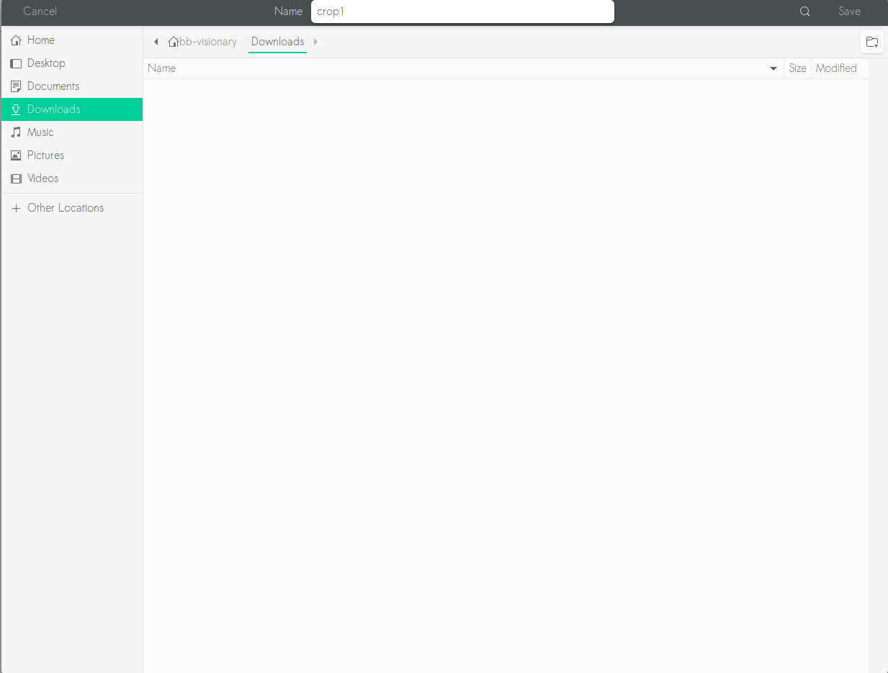
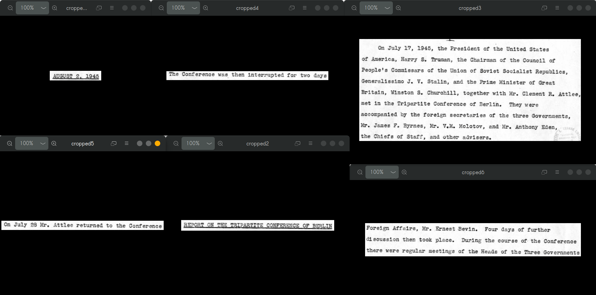

# ReactJS Image Multi Crop

# Installation
Install via [npm]()  
```npm install --save react-image-multi-crop```
# Quick Example
```import ImageMultiCrop from 'react-image-multi-crop```  

# User Experience
###Step 1: Highlight all your desired areas  
  
###Step 2: Check the cropped areas 
  
###Step 3: Download it all
  
###Step 4: Do whatever you want with it  


# Options
##src (required)
* Type: `string`
* Default: `null`  

`<ImageMultiCrop src={'https://help.heinonline.org/wp-content/uploads/kb5-7.png'} />`  
`<ImageMultiCrop src={require('./img/report.png')} />`

##alt (optional)
* Type: `string`
* Default: `null`  

##align (optional)
* Type: `string`
* Default: `"center"`

##checker (optional)
* Type: `bool`
* Default: `false`  

##counter (optional)
* Type: `bool`
* Default: `false`  

# Author
Christopher Lim(lim.christopher.go@gmail.com)
